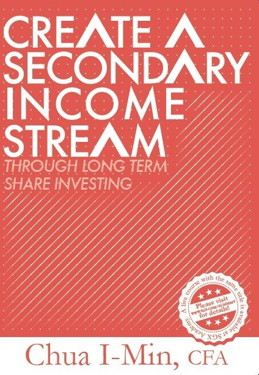

# 📚 Knowledge Library

A curated collection of books that shape my understanding of:


This repository is not a reading tracker. It is a map of ideas, concepts, and frameworks that influence how I think, design systems, and solve problems.

---

# Books

## Data Engineering & AI Systems - by J.Reis & Matth Housely


**Authors:** Joe Reis, Matt Housley  
**Publisher:** O'Reilly Media  


## The 30 Day MBA (Master in Business Administration) - by Colin Barrow


**Author:** Colin Barrow  
**Publisher:** Kohan Page  


## Create A Secondary Income Stream - by Chua I-Min



**Author:** Chua I-Min  
**Coutesy of:** The Singapore Stock Exchange (SGX), Temasek Holding and GIC  


## The Art of War - by Sun Tzu


**Author:** Sun Tzu  
**Edition:** Capstone Classics  
**Introduction:** Tom Butler-Bowdon  


---

## Tao Te Ching - by Lau Tzu


**Author:** Lao Tzu  
**Edition:** Capstone Classics  
**Introduction:** Tom Butler-Bowdon  


---

<!--

# Image Guidelines

For consistent GitHub rendering:

## Book Covers

Recommended size:

```
Width: 300 px
Height: proportional
Format: JPG or WebP
File size: <200 KB
```

Recommended display size:

```markdown

```

This prevents README pages from becoming overly long.

## Suggested Aspect Ratio

Most book covers are approximately:

```
2 : 3
```

Example:

```
300 × 450 px
240 × 360 px
180 × 270 px
```

The repository should prioritize readability over maximum image resolution.

---

-->

# Future Additions

Planned categories:

* Data Science & Machine Learning
* Large Language Models
* Software Architecture
* Complex Systems Engineering
* Manufacturing & Product Design
* Economics & Decision Making
* Psychology & Human Behaviour

---

# Philosophy

> Learn broadly. Build deeply. Connect ideas across disciplines.

The goal is not to collect books.

The goal is to build a mental model.

